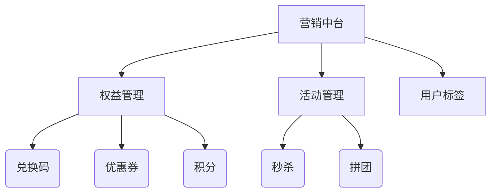

# marketing-service

营销服务,核心职责是促销转化, 包含功能模块：兑换码、优惠券、秒杀、积分、秒杀、拼团等通用权益功能

## 通用服务化

- 兑换码、优惠券、积分等通用权益功能
- 采用插件化设计：兑换码作为核心插件，支持多产品线配置
- 功能增强
  - 多类型支持（一次性/多次/比例折扣等）
  - 组合验证规则（时间/用户层级/产品范围）
  - 批量生成+异步发放能力

## 中台化演进阶段

- 扩展为「营销中台」服务，包含：

- 统一管理所有营销相关资源
- 提供可视化规则配置后台

## 技术实现关键点

1. 多租户隔离：采用 product_code+tenant_id 双维度隔离
