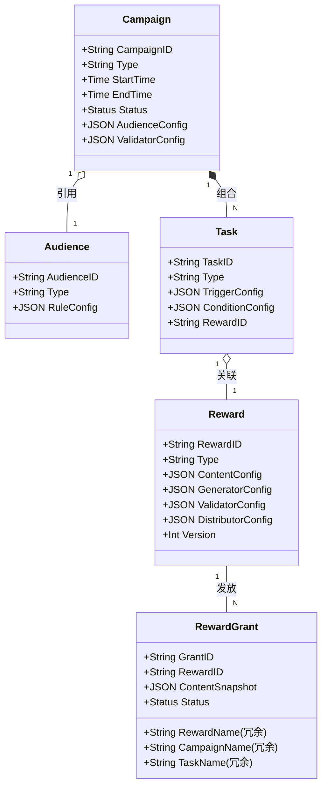
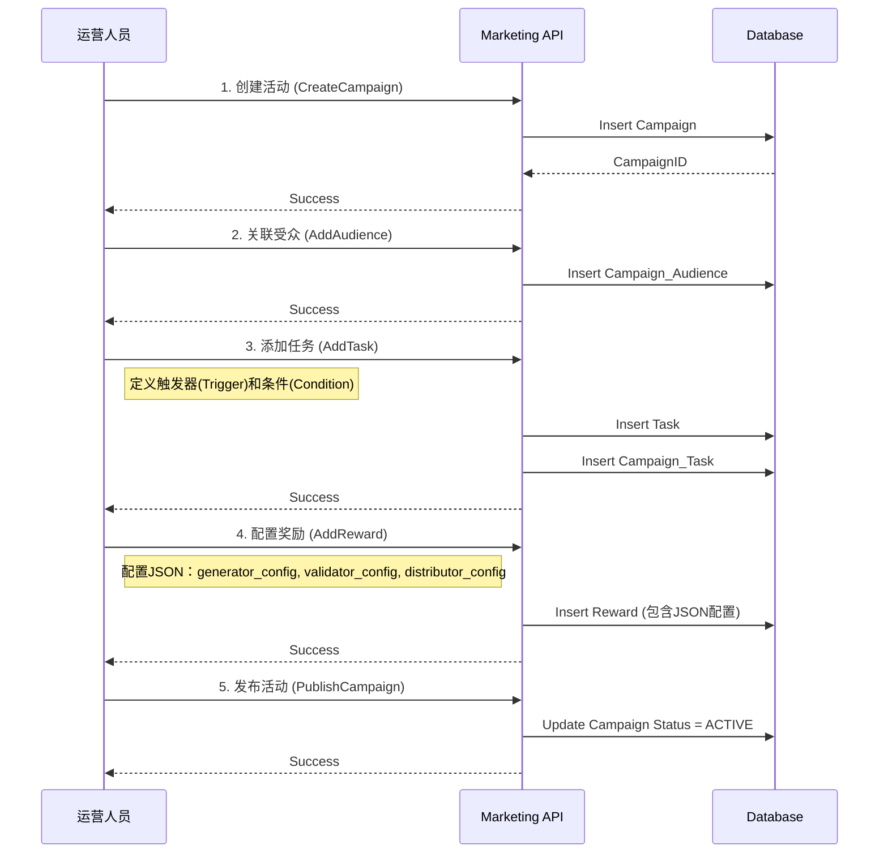
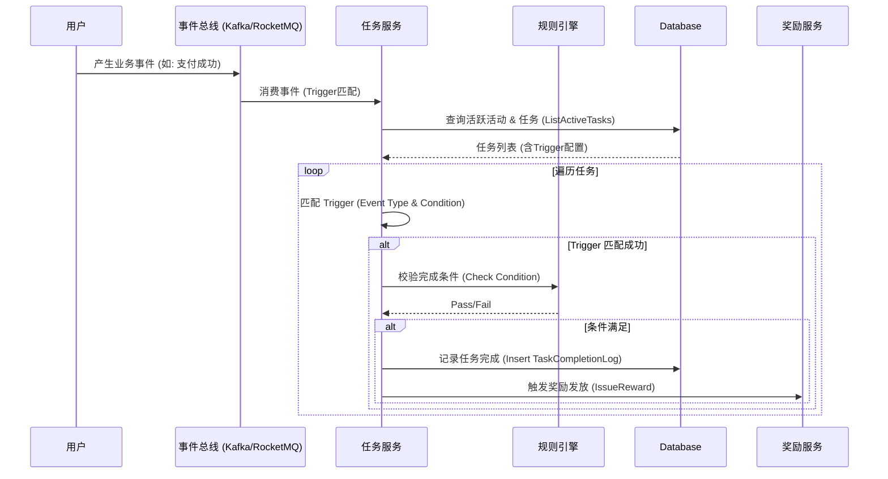
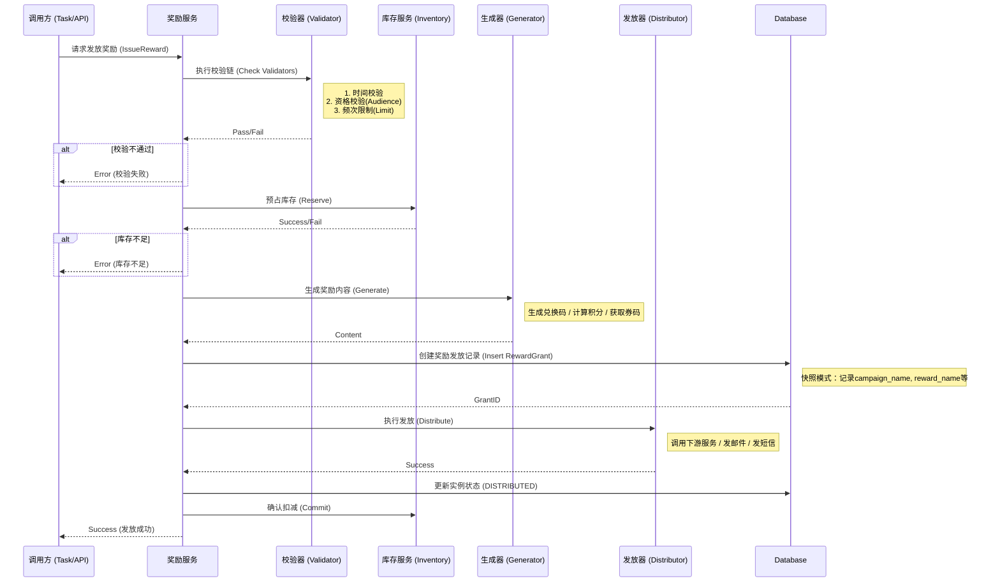

# 营销服务业务逻辑设计

本文档主要通过 UML 图表展示营销服务的核心业务逻辑和流程。

## 1. 核心领域模型 (Domain Model)

展示四个核心实体及其关系。Generator/Validator/Distributor 作为配置组件存储在 Reward 表中。

**设计说明**：
- **核心实体**：Campaign, Audience, Task, Reward 存储在独立表中
- **配置组件**：Generator/Validator/Distributor 以 JSON 格式存储在 Reward 表中
- **冗余字段**：RewardGrant 中的 name 字段采用快照模式，不随源数据修改

## 2. 活动创建流程 (Campaign Creation)

展示如何通过积木组合创建一个活动。

## 3. 任务触发与完成流程 (Task Trigger & Completion)

展示基于事件驱动的任务处理流程。

## 4. 奖励发放流程 (Reward Distribution)

展示奖励发放的详细逻辑，包括校验、库存扣减和实际发放。

