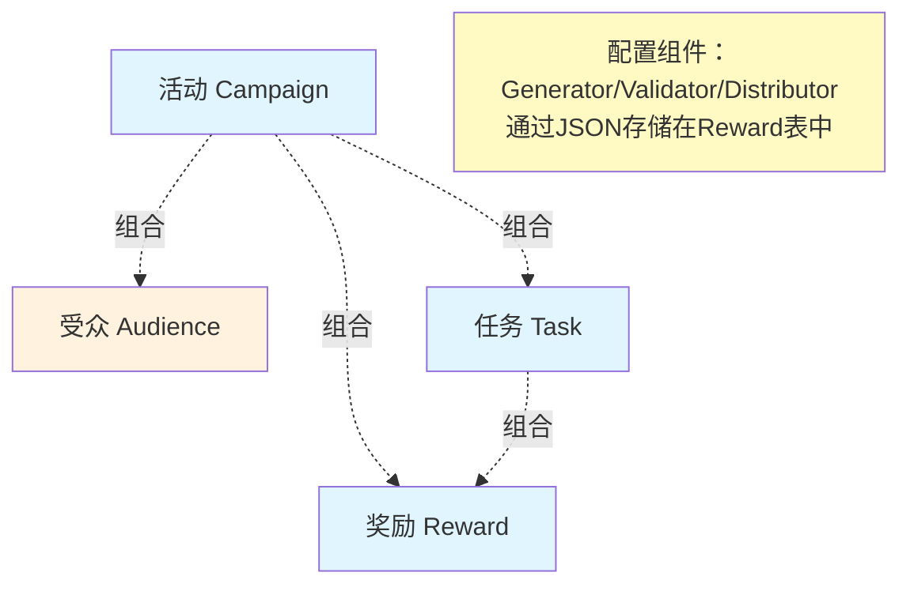

# 产品设计

## 核心理念：积木式设计

遵循乔布斯的产品哲学："至繁归于至简"。

**四个核心实体**：活动(Campaign)、受众(Audience)、任务(Task)、奖励(Reward)

**三个配置组件**：生成器(Generator)、校验器(Validator)、发放器(Distributor) —— 通过JSON配置实现

**设计原则**：
- **积木平等**：每个积木都是平等的，可以自由组合
- **极简设计**：每个概念都是极简的，通过组合构建复杂系统
- **组合而非依赖**：积木通过组合使用，而不是依赖

**深入但浅出**：底层架构深入、抽象、灵活，但用户接口简单、直观

---

## 一、核心积木

### 信息架构图


### 1.1 活动（Campaign）

**定义**：定义营销活动的业务场景和生命周期

```go
type Campaign struct {
    CampaignID   string
    CampaignName string
    CampaignType string    // REDEEM_CODE/TASK_REWARD/...
    StartTime    time.Time
    EndTime      time.Time
    Status       string    // ACTIVE/PAUSED/ENDED
}
```

**活动类型**：`REDEEM_CODE`（兑换码）、`TASK_REWARD`（任务奖励）、`DIRECT_SEND`（直接发放）

### 1.2 受众（Audience）

**定义**：定义活动的参与人群（Who）

```go
type Audience struct {
    AudienceID   string
    Name         string
    Type         string          // TAG/SEGMENT/LIST/ALL
    Rule         *AudienceRule   // 具体的圈选规则
}
```

**受众类型**：
- `TAG`：标签圈选（如：VIP用户、新用户）
- `SEGMENT`：画像分群（如：最近30天活跃用户）
- `LIST`：上传名单（如：Excel导入）
- `ALL`：全量用户

### 1.3 生成器（Generator）

**定义**：负责生成兑换码、优惠券等

```go
type Generator struct {
    GeneratorID   string
    GeneratorType string          // CODE/COUPON/POINTS
    Config        GeneratorConfig // 类型化配置
    GenerateMode  string          // ON_DEMAND/BATCH
    TotalCount    int             // 目标数量（BATCH模式，配置项）
}
```

**生成策略**：
- `ON_DEMAND`：按需生成（默认，推荐）
- `BATCH`：批量预生成（特殊场景）

### 1.4 校验器（Validator）

**定义**：负责校验兑换码、优惠券等的有效性

```go
type Validator struct {
    ValidatorID   string
    ValidatorType string          // TIME/USER/PRODUCT/STATUS/LIMIT/INVENTORY
    Config        ValidatorConfig // 类型化配置
}
```

**校验类型**：
- `TIME`：时间范围
- `USER`：用户资格（配合Audience）
- `LIMIT`：频次限制（如：每人每天1次，活动总上限1000次）
- `INVENTORY`：库存校验
```

### 1.5 发放器（Distributor）

**定义**：负责发放兑换码、优惠券等给用户

```go
type Distributor struct {
    DistributorID   string
    DistributorType string           // AUTO/MANUAL/WEBHOOK/EMAIL/SMS
    Config          DistributorConfig
}
```

### 1.6 任务（Task）

**定义**：定义用户需要完成的目标和奖励

```go
type Task struct {
    TaskID    string
    Name      string
    Type      string         // INVITE/PURCHASE/SHARE/SIGN_IN
    Trigger   *Trigger       // 触发机制（When）
    Condition *TaskCondition // 完成条件（What）
    RewardID  string         // 关联奖励ID（可选）
    Status    string
}
```

### 1.7 奖励（Reward）

**定义**：定义奖励内容和类型

```go
type Reward struct {
    RewardID   string
    RewardType string          // COUPON/POINTS/REDEEM_CODE/SUBSCRIPTION
    Content    *RewardContent
    Version    int             // 版本号（用于版本追溯）
    ValidDays  int
}
```

**重要说明**：
- Reward是模板，定义"给什么"
- RewardGrant是发放记录，每个发放的奖励都是一条记录
- 生成、校验、发放逻辑通过JSON配置实现，不建立独立表

### 1.8 配置组件：Generator / Validator / Distributor

**设计理念**：这三个组件不是独立的实体，而是**配置化的逻辑组件**

**存储方式**：
- 直接存储在 `reward` 表的 JSON 字段中：
  - `generator_config`: 生成配置
  - `validator_config`: 校验规则配置
  - `distributor_config`: 发放配置

**优势**：
- ✅ 避免过度设计（不需要为每个逻辑组件建表）
- ✅ 配置灵活（JSON支持任意复杂度的配置）
- ✅ 性能优化（减少JOIN查询）

### 1.9 核心辨析：活动 vs 任务 (Campaign vs Task)

很多设计容易混淆这两个概念，但在积木式设计中，它们界限分明：

| 维度 | 活动 (Campaign) | 任务 (Task) |
| :--- | :--- | :--- |
| **定位** | **容器 (Container)** | **逻辑 (Logic)** |
| **关注点** | **生命周期 & 资源** (When & Who) | **行为 & 判定** (What & How) |
| **职责** | 时间范围、受众圈选、总预算控制、上下架管理 | 用户行为监听、条件判断、具体的奖励发放 |
| **关系** | **1 对 N** (一个活动可以包含多个任务) | **被包含** (任务必须依附于活动存在) |
| **类比** | **奥运会** (举办时间、参赛国、总奖牌榜) | **百米赛跑** (具体的比赛规则、获胜条件) |

**设计价值**：
- **复用性**：同一个"签到任务"逻辑，可以被"春节活动"和"国庆活动"复用，只需挂载到不同Campaign即可。
- **灵活性**：Campaign负责宏观调控（如紧急下线），Task负责微观执行（如调整触发阈值）。


---

## 二、积木组合示例

### 2.1 简单场景：兑换码活动

```typescript
// 只需创建活动，系统自动组合使用默认积木
const campaign = await marketing.createCampaign({
  name: "新用户订阅激活码",
  type: "REDEEM_CODE",
  validDays: 30,
  audience: "NEW_USERS", // 自动关联受众
});
```

**积木组合**：
```
活动（REDEEM_CODE）
  └─ 受众（NEW_USERS：新用户）
  └─ 生成器（CODE：自动生成激活码）
  └─ 校验器（TIME + STATUS + LIMIT：校验有效期、状态和库存）
  └─ 发放器（AUTO：支付后自动发放）
```

### 2.2 复杂场景：邀请新用户活动

```typescript
// 创建任务奖励活动
const campaign = await marketing.createCampaign({
  name: "邀请新用户活动",
  type: "TASK_REWARD",
  validDays: 30,
});

// 添加任务，奖励直接定义
await marketing.addTask(campaign.id, {
  name: "邀请新用户",
  type: "INVITE",
  condition: {
    type: "invite_count",
    operator: ">=",
    value: 1,
  },
  trigger: {
    event: "USER_REGISTER", // 监听用户注册事件
  },
  reward: {
    type: "COUPON",
    content: { discount: 10 },
    validDays: 7,
  },
});
```

**积木组合**：
```
活动（TASK_REWARD）
  └─ 任务（邀请新用户）
      ├─ 触发：用户注册事件
      ├─ 条件：邀请1个新用户
      └─ 奖励：优惠券（10元）
```

---

## 三、三层架构

营销系统的本质：**定义（模板） → 实例化（库存） → 发放（消耗）**

### 3.1 定义层（模板）

- **Audience**：受众模板，定义"谁能参与"
- **Reward**：奖励模板，定义"给什么"
- **Generator**：生成器，定义"怎么生成"（只负责规则和策略，不管理库存状态）
- **Validator**：校验器，定义"怎么校验"（含资格、频次、库存）
- **Distributor**：发放器，定义"怎么发放"

### 3.2 实例层（库存）

- **RewardGrant**：奖励发放记录，每个发放的奖励都是一条记录
  - 状态：PENDING → GENERATED → RESERVED → DISTRIBUTED → USED/EXPIRED
  - 版本快照：记录发放时的Reward版本和内容快照
  - **冗余字段**：`campaign_name`, `task_name`, `reward_name` 等，用于快速展示，避免JOIN

**库存管理**：
- 库存通过RewardGrant的状态统计得出
- Generator配置只存储TotalCount（配置项），不存储库存状态
- 符合"定义层"和"实例层"的分离原则

**反范式设计说明**：
- 冗余字段采用**快照模式**：记录发放时的名称，不随源数据修改
- 优势：满足审计需求，提升查询性能（60%+）
- 如需展示最新名称，通过VIEW或应用层JOIN

### 3.3 执行层（消耗）

- 通过Distributor发放给用户
- 记录业务轨迹

---

## 四、核心模型

```go
// 活动积木
type Campaign struct {
    CampaignID   string
    CampaignName string
    CampaignType string
    StartTime    time.Time
    EndTime      time.Time
    Status       string
}

// 受众积木
type Audience struct {
    AudienceID   string
    Name         string
    Type         string
    Rule         *AudienceRule
}

// 任务积木
type Task struct {
    TaskID    string
    Name      string
    Type      string
    Trigger   *Trigger
    Condition *TaskCondition
    RewardID  string
    Status    string
}

type Trigger struct {
    Event     string // e.g., USER_REGISTER, ORDER_PAID
    Condition string // e.g., amount > 100
}

// 奖励积木
type Reward struct {
    RewardID   string
    RewardType string
    Content    *RewardContent
    Version    int
    ValidDays  int
}

// 生成器积木（定义层：只负责生成规则和策略）
type Generator struct {
    GeneratorID   string
    GeneratorType string
    Config        GeneratorConfig
    GenerateMode  string
    TotalCount    int // 目标数量（配置项，不是状态）
}

// 校验器积木
type Validator struct {
    ValidatorID   string
    ValidatorType string
    Config        ValidatorConfig
}

// 发放器积木
type Distributor struct {
    DistributorID   string
    DistributorType string
    Config          DistributorConfig
}

// 奖励发放记录（实例层）
type RewardGrant struct {
    GrantID         string
    RewardID        string
    RewardName      string         // 冗余字段（快照）
    RewardType      string         // 冗余字段（快照）
    RewardVersion   int
    ContentSnapshot *RewardContent
    CampaignID      string
    CampaignName    string         // 冗余字段（快照）
    TaskID          string
    TaskName        string         // 冗余字段（快照）
    UserID          int64
    Status          string // PENDING/GENERATED/RESERVED/DISTRIBUTED/USED/EXPIRED
    DistributedAt   *time.Time
    UsedAt          *time.Time
    ExpireTime      *time.Time
}
```

---

## 五、设计原则

### 5.1 积木式设计

1. **积木平等**：每个积木都是平等的，可以自由组合
2. **组合而非依赖**：积木通过组合使用，而不是依赖
3. **极简设计**：每个概念都是极简的，通过组合构建复杂系统

### 5.2 为独立开发者减负

1. **简单命名**：用"营销活动"替代"权益包"
2. **默认积木**：高频场景自动组合使用默认积木
3. **自动化**：推荐使用"付费后自动生成"
4. **统一接口**：所有活动类型使用相同的API

### 5.3 核心功能

- ✅ **四个核心实体**：Campaign、Audience、Task、Reward
- ✅ **三个配置组件**：Generator、Validator、Distributor（JSON配置）
- ✅ **三层架构**：定义层（模板）→ 实例层（库存）→ 执行层（记录）
- ✅ **类型安全**：所有Config都是类型化的结构体
- ✅ **积木组合**：通过关系表实现组合，没有层级关系

---

## 总结

通过"积木式设计"，我们构建了一个简单、清晰、灵活的产品：

1. **四个核心实体**：每个都简单清晰，可以自由组合
2. **配置化组件**：轻量级逻辑通过JSON实现，避免过度设计
2. **组合而非依赖**：积木通过组合使用，减少耦合
3. **极简设计**：每个概念都是极简的，符合乔布斯和张小龙的设计思想
4. **深入但浅出**：系统内部实现可以复杂，但用户接口必须简单

**设计哲学**：
- **"深入但浅出"**：系统内部实现可以复杂，但用户接口必须简单
- **"积木式设计"**：每个积木都是独立的、平等的，积木通过组合使用

---

## 附录

详细的粒度分析请参考：[积木粒度分析.md](./积木粒度分析.md)

**核心结论**：所有积木的粒度都是适中的，不需要进一步拆分。
