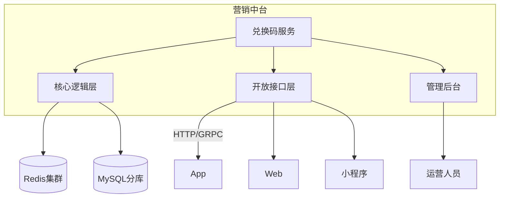
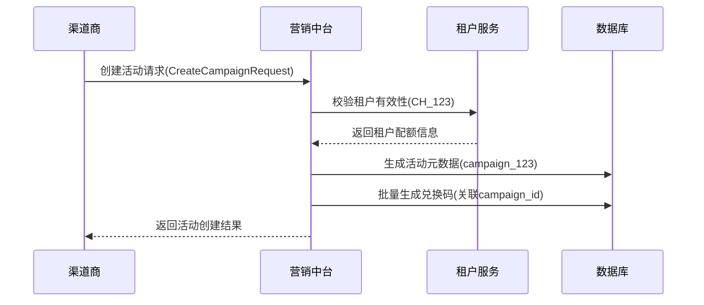
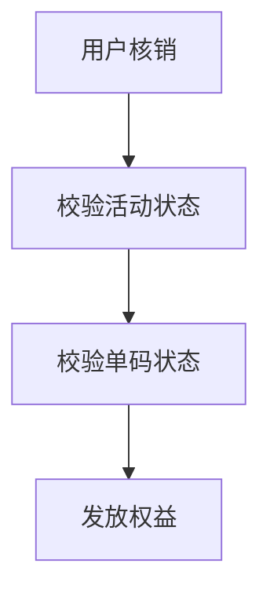
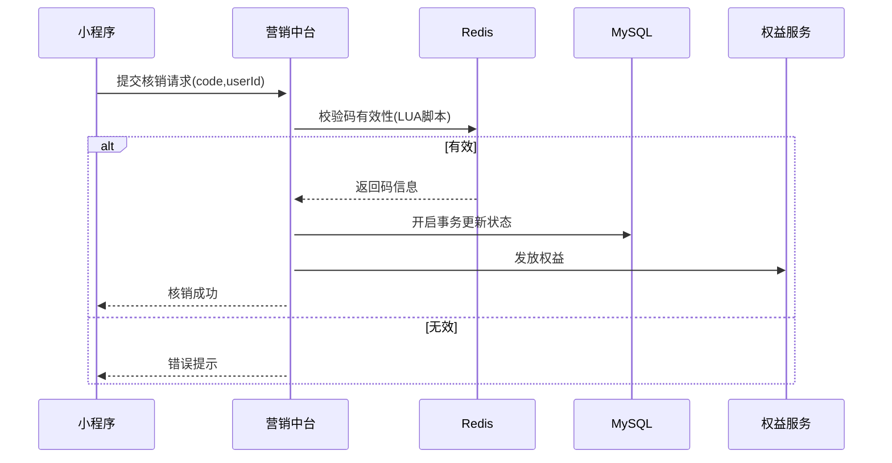
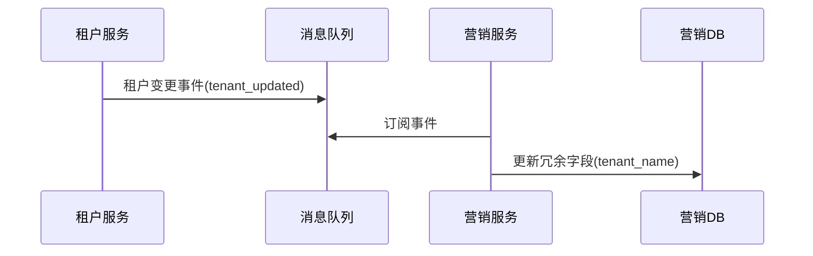

## 兑换码

兑换码功能技术设计方案，基于营销中台服务架构，支持多终端多产品线复用

## 一、整体架构设计



## 二、核心功能设计

1. 兑换码生成方案
   设计要点：

   - 支持单条/批量生成
   - 多类型码兼容（数字/字母/混合）
   - 预生成+异步分配机制

2. 多租户隔离设计

数据模型：

```sql

CREATE TABLE redeem_codes (
    redeem_code_id BIGINT PRIMARY KEY,
    code VARCHAR(32) UNIQUE,
    product_code VARCHAR(16) NOT NULL,  -- 产品线标识
    tenant_id VARCHAR(24) NOT NULL,     -- 租户字段（区分不同租户如企业客户、渠道商）
    campaign_id VARCHAR(32),
    user_id BIGINT DEFAULT NULL,
    status TINYINT DEFAULT 0,
    expired_at DATETIME,
    extra_data JSON,
    -- 联合唯一约束
    UNIQUE KEY uk_code_tenant (code, tenant_id),
    -- 复合索引
    KEY idx_tenant_product (tenant_id, product_code)
) PARTITION BY KEY(tenant_id, product_code);

```

3. 渠道商创建活动的完整流程



3. 高性能核销流程

兑换码核销流程



核销时序图：



LUA 脚本示例：

```lua
-- KEYS[1]: code_key, ARGV[1]: current_time
local code_data = redis.call('HGETALL', KEYS[1])
if not code_data or #code_data == 0 then
    return 0 -- 不存在
end

if tonumber(code_data[4]) < tonumber(ARGV[1]) then
    return 1 -- 已过期
end

if code_data[6] ~= '0' then
    return 2 -- 已使用
end

redis.call('HSET', KEYS[1], 'status', '1')
return 3 -- 可用
```

## 三、核心接口与结构体定义

```go
// 码生成规则结构体
type CodeGenerateRule struct {
	CodeType     string   `json:"codeType"` // RANDOM_NUM/ALPHANUM/UUID
	Length       int      `json:"length"`
	Prefix       string   `json:"prefix"`
	ExcludeChars []string `json:"excludeChars"` // 需要排除的字符
}

// 生成器接口定义
type CodeGenerator interface {
	Generate(rule CodeGenerateRule) (string, error)
}

// 批量生成服务结构体
type BatchCodeService struct {
	generator CodeGenerator
	redisCli  *redis.Client
}
```

## 四、具体实现方案

1. 基础生成器实现（线程安全）

```go
// 随机数生成器实现
type RandomCodeGenerator struct {
	mu sync.Mutex
	r  *rand.Rand
}

func NewRandomCodeGenerator() *RandomCodeGenerator {
	return &RandomCodeGenerator{
		r: rand.New(rand.NewSource(time.Now().UnixNano())),
	}
}

func (g *RandomCodeGenerator) Generate(rule CodeGenerateRule) (string, error) {
	g.mu.Lock()
	defer g.mu.Unlock()

	const (
		digits    = "0123456789"
		alphabet  = "ABCDEFGHIJKLMNOPQRSTUVWXYZ"
		allChars  = digits + alphabet
	)

	var charPool string
	switch rule.CodeType {
	case "RANDOM_NUM":
		charPool = digits
	case "ALPHANUM":
		charPool = allChars
	default:
		return "", fmt.Errorf("unsupported code type: %s", rule.CodeType)
	}

	// 过滤排除字符
	for _, c := range rule.ExcludeChars {
		charPool = strings.ReplaceAll(charPool, c, "")
	}

	buf := make([]byte, rule.Length)
	for i := range buf {
		buf[i] = charPool[g.r.Intn(len(charPool))]
	}

	return rule.Prefix + string(buf), nil
}

```

2. 批量生成服务（带并发控制）

```go
func (s *BatchCodeService) GenerateCodes(ctx context.Context, rule CodeGenerateRule, count int) ([]string, error) {
	var (
		wg         sync.WaitGroup
		results    = make([]string, count)
		errChan    = make(chan error, 1)
		ctxCancel  context.CancelFunc
		concurrent = runtime.NumCPU() * 2 // 2倍CPU数的并发
	)

	ctx, ctxCancel = context.WithCancel(ctx)
	defer ctxCancel()

	sem := make(chan struct{}, concurrent) // 信号量控制并发数

	for i := 0; i < count; i++ {
		select {
		case <-ctx.Done():
			return nil, ctx.Err()
		default:
			wg.Add(1)
			go func(idx int) {
				defer wg.Done()
				sem <- struct{}{}
				defer func() { <-sem }()

				code, err := s.generator.Generate(rule)
				if err != nil {
					select {
					case errChan <- err:
						ctxCancel()
					default:
					}
					return
				}

				// Redis原子化操作
				if _, err := s.redisCli.SAdd(ctx,
					fmt.Sprintf("pre_generated_codes:%s", rule.CampaignId),
					code,
				).Result(); err != nil {
					errChan <- err
					return
				}

				results[idx] = code
			}(i)
		}
	}

	wg.Wait()
	close(errChan)

	if err := <-errChan; err != nil {
		return nil, err
	}
	return results, nil
}
```

## 五、工程化增强设计

1. Redis 连接池配置

```go

func NewRedisClient(addr string) *redis.Client {
	return redis.NewClient(&redis.Options{
		Addr:         addr,
		PoolSize:     100,           // 连接池大小
		MinIdleConns: 10,            // 最小空闲连接
		MaxConnAge:   5 * time.Minute,
		ReadTimeout:  2 * time.Second,
	})
}

```

2. 性能优化建议

- 批量管道操作（适用于生成 10 万+场景）：

```go
pipe := redisCli.Pipeline()
for _, code := range codes {
    pipe.SAdd(ctx, redisKey, code)
}
if _, err := pipe.Exec(ctx); err != nil {
    // 错误处理
}

```

- 内存优化：

```go
// 使用strings.Builder替代字节数组拼接
func generateCode() string {
    var sb strings.Builder
    sb.Grow(rule.Length) // 预分配内存
    // ...生成逻辑
    return sb.String()
}

```

## 六、单元测试示例

```go
func TestBatchGeneration(t *testing.T) {
	mockRedis := redismock.NewMockClient()
	mockRedis.MatchExpectationsInOrder(false)

	// Mock Redis响应
	mockRedis.ExpectSAdd("pre_generated_codes:campaign_123", mock.Anything).
		SetVal(1).
		Repeat(100)

	svc := &BatchCodeService{
		generator: NewRandomCodeGenerator(),
		redisCli:  mockRedis,
	}

	codes, err := svc.GenerateCodes(context.Background(), CodeGenerateRule{
		CodeType: "RANDOM_NUM",
		Length:   8,
	}, 100)

	assert.NoError(t, err)
	assert.Len(t, codes, 100)
	assert.NoError(t, mockRedis.ExpectationsWereMet())
}
```

## 七、生产环境

1. 监控指标：

```go
// Prometheus指标采集
var (
    codesGenerated = prometheus.NewCounterVec(
        prometheus.CounterOpts{
            Name: "marketing_codes_generated_total",
            Help: "Total generated redemption codes",
        },
        []string{"campaign_id"},
    )
)

func init() {
    prometheus.MustRegister(codesGenerated)
}

// 在生成逻辑中添加
codesGenerated.WithLabelValues(rule.CampaignId).Add(float64(count))
```

2. 错误恢复：

```
// 使用golang.org/x/sync/errgroup实现更安全的并发
g, ctx := errgroup.WithContext(ctx)
g.SetLimit(concurrent)

g.Go(func() error {
    // 生成逻辑
})

if err := g.Wait(); err != nil {
    // 错误处理
}
```

## 八、多端复用方案

1. 统一接入层设计

```yaml
paths:
  /api/redeem:
    post:
      tags: [营销中台]
      parameters:
        - $ref: "#/components/headers/x-product-code"
        - $ref: "#/components/headers/x-device-id"
      requestBody:
        content:
          application/json:
            schema:
              type: object
              properties:
                code: { type: string }
                userId: { type: string }
              required: [code, userId]
```

2. 客户端适配方案
   多端 SDK 设计：

```typescript
class MarketingSDK {
  constructor(
    private options: {
      productCode: string;
      env: "web" | "app" | "mini";
    }
  ) {}

  async redeemCode(code: string): Promise<Result> {
    // 统一处理各端差异
    const headers = this.buildHeaders();
    return axios.post("/api/redeem", { code }, { headers });
  }
}

// Web端使用示例
const sdk = new MarketingSDK({ productCode: "PC_MAIN", env: "web" });
```

## 九、关键业务规则配置

1. 规则引擎设计

```json
{
  "ruleId": "invite_reward_2023",
  "codeType": "RANDOM_ALPHANUM",
  "length": 12,
  "validDays": 30,
  "useLimit": 1,
  "applicableProducts": ["APP_A", "MINI_B"],
  "rewardRules": [
    {
      "type": "COUPON",
      "id": "NEW_USER_10OFF",
      "condition": {
        "userTag": "invited_user"
      }
    }
  ]
}
```

2. 防刷策略

- 分级限流：

```python
# 基于产品线的限流配置
RATE_LIMIT_RULES = {
    'APP_A': {'day': 1000, 'hour': 100},
    'WEB_B': {'day': 5000, 'hour': 500}
}

# 滑动窗口计数
def check_rate_limit(product_code: str):
    key = f"rate_limit:{product_code}:{datetime.now().hour}"
    count = redis.incr(key)
    if count > RATE_LIMIT_RULES[product_code]['hour']:
        raise RateLimitException()
```

- 补偿脚本示例：

```bash
# 核销状态补偿
mysql -e "UPDATE redeem_codes SET status=2
  WHERE status=1 AND EXISTS(SELECT 1 FROM reward_records WHERE code_id=redeem_codes.id)"
```

数据冗余策略

在营销库中冗余必要的租户字段：
```sql

-- 营销库的campaigns表设计
CREATE TABLE campaigns (
    campaign_id VARCHAR(32) PRIMARY KEY,
    tenant_id VARCHAR(24) NOT NULL COMMENT '租户ID（来自tenant_service库）',
    tenant_name VARCHAR(64) COMMENT '租户名称（冗余字段）',
    tenant_type ENUM('PLATFORM','CHANNEL') COMMENT '租户类型（冗余）',
    FOREIGN KEY (tenant_id) REFERENCES tenant_service.tenants(tenant_id) -- 跨库外键（不推荐实际使用）
);

```

2. 实时关联查询方案

```go

// 营销服务中的查询示例
func (s *MarketingService) GetCampaignWithTenant(ctx context.Context, campaignID string) (*CampaignWithTenant, error) {
    // 1. 查询营销库
    campaign, err := s.campaignRepo.Get(ctx, campaignID)
    if err != nil {
        return nil, err
    }
    
    // 2. 调用租户服务（通过gRPC）
    tenant, err := s.tenantClient.GetTenant(ctx, &pb.GetTenantRequest{
        TenantId: campaign.TenantID,
    })
    
    return &CampaignWithTenant{
        Campaign: campaign,
        Tenant:   tenant,
    }, nil
}

```

3. 最终一致性方案



